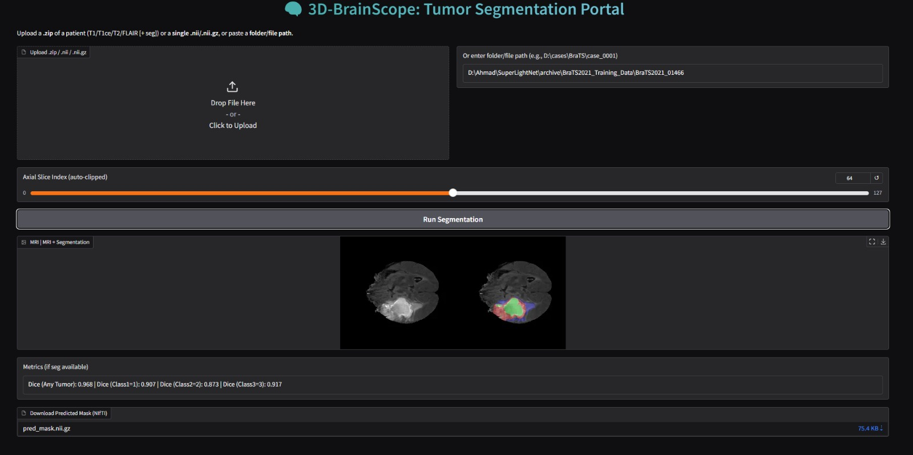
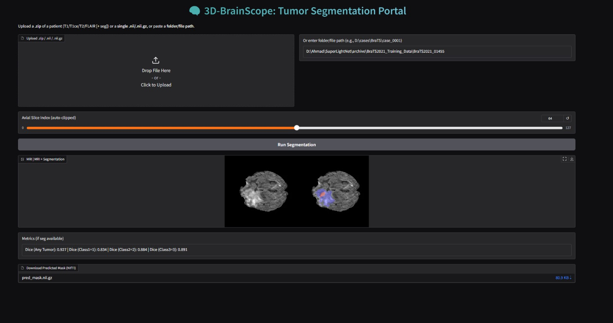

# Lightweight 3D Brain Tumor Segmentation

This project implements a lightweight deep learning framework for multimodal **3D brain tumor segmentation** on the BraTS2021 dataset.  
It focuses on efficient training and inference while preserving segmentation quality.

---

## 🔑 Key Features
- **Lightweight model** implementation in PyTorch.  
- **Patch-based preprocessing** to handle 3D MRI volumes on limited hardware.  
- **Segmentation visualization UI** built with Gradio.  
- Experiments on efficiency, memory footprint, and segmentation accuracy.  

---

## 📂 Project Structure
- `train.py` — Training pipeline.  
- `dataset.py` — Dataset loader and patch extraction.  
- `config.py` — Configurations and hyperparameters.  
- `loss_metrics.py` — Loss functions and evaluation metrics.  
- `project_main.py` — Main entry point for running the project.  
- `app.py` — Gradio UI for visualization.  
- `checkpoints/` — Contains trained model weights (`best.pth`).  

---

## ⚙️ Installation
1. Clone the repository:
   ```bash
   git clone https://github.com/ahmedjawad24/Lightweight-Brain-Tumor-Segmentation.git
   cd Lightweight-Brain-Tumor-Segmentation

Create a virtual environment and install dependencies:

Bash

python -m venv venv

source venv/bin/activate   # (Linux/Mac)

venv\Scripts\activate      # (Windows)

pip install -r requirements.txt


🚀 Usage

Training
python train.py


Run UI for segmentation visualization

python app.py

Open the Gradio link shown in the terminal to interact with the model.

📌 Notes
Dataset is not included in this repository due to size.
Download the BraTS2021 dataset and update dataset paths in config.py.

Pretrained model weight best.pth is provided under checkpoints/.

🧠 Dataset
BraTS2021 Challenge Dataset

---

## 📷 Results Preview
Here are some example outputs from the segmentation model:

<p align="center">
  
  
</p>


📜 License
This project is open-source and available under the MIT License.
